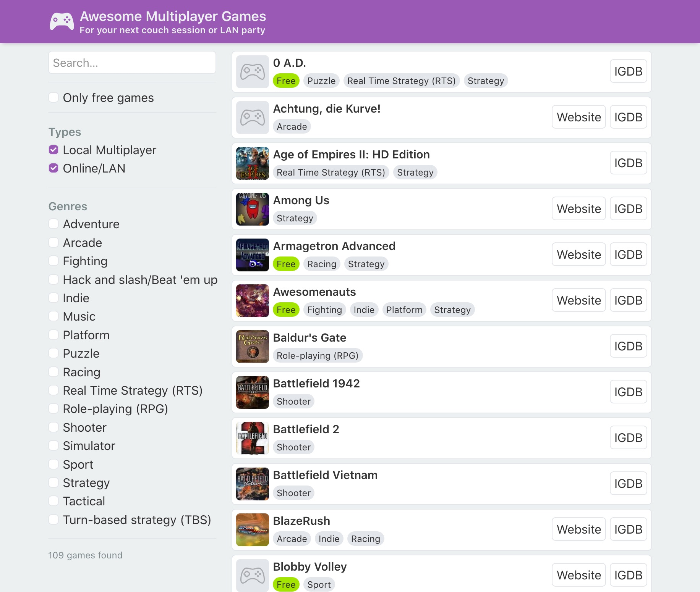

# Awesome Multiplayer Games Frontend

The webapp for the [Awesome Multiplayer Games website](https://multiplayer.page), connecting to the [awesome-games-api](https://github.com/herrherrmann/awesome-games-api).

## Available Scripts

### `yarn start`

Runs the app in the development mode. 
Open [http://localhost:3000](http://localhost:3000) to view it in the browser.

### `yarn test`

Launches the test runner in the interactive watch mode. 
See the section about [running tests](https://facebook.github.io/create-react-app/docs/running-tests) for more information.

### `yarn build`

Builds the app for production to the `build` folder.
